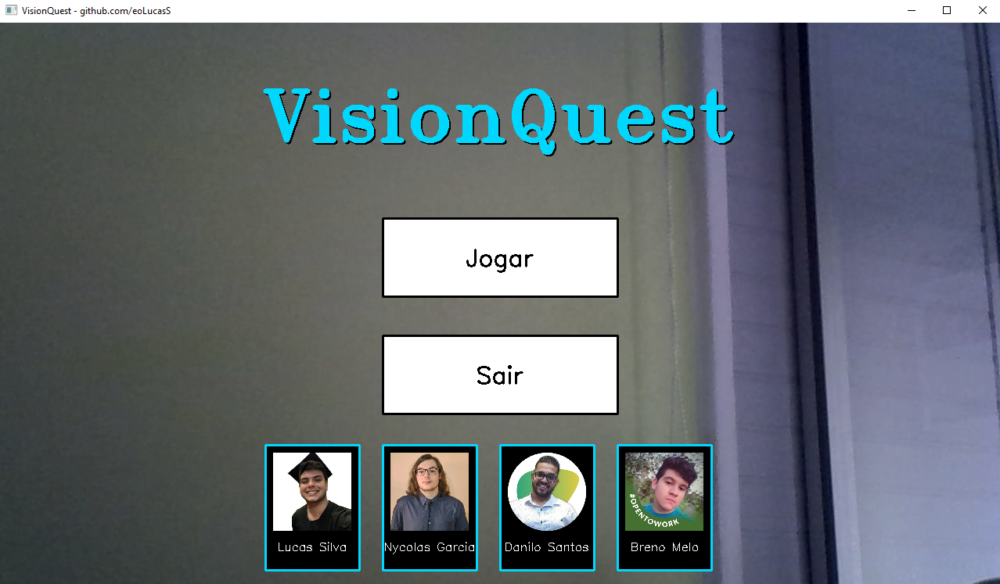

<!-- 
$$$$$$$\                                $$\                                     $$\       $$\
$$  __$$\                               $$ |                                    $$ |      $$ |
$$ |  $$ | $$$$$$\ $$\    $$\  $$$$$$\  $$ | $$$$$$\   $$$$$$\   $$$$$$\   $$$$$$$ |      $$$$$$$\  $$\   $$\
$$ |  $$ |$$  __$$\\$$\  $$  |$$  __$$\ $$ |$$  __$$\ $$  __$$\ $$  __$$\ $$  __$$ |      $$  __$$\ $$ |  $$ |
$$ |  $$ |$$$$$$$$ |\$$\$$  / $$$$$$$$ |$$ |$$ /  $$ |$$ /  $$ |$$$$$$$$ |$$ /  $$ |      $$ |  $$ |$$ |  $$ |
$$ |  $$ |$$   ____| \$$$  /  $$   ____|$$ |$$ |  $$ |$$ |  $$ |$$   ____|$$ |  $$ |      $$ |  $$ |$$ |  $$ |
$$$$$$$  |\$$$$$$$\   \$  /   \$$$$$$$\ $$ |\$$$$$$  |$$$$$$$  |\$$$$$$$\ \$$$$$$$ |      $$$$$$$  |\$$$$$$$ |
\_______/  \_______|   \_/     \_______|\__| \______/ $$  ____/  \_______| \_______|      \_______/  \____$$ |
                                                      $$ |                                          $$\   $$ |
                                                      $$ |                                          \$$$$$$  |
                                                      \__|                                           \______/
$$\                                                   $$\                                                          $$\                  $$$$$$\  $$\ $$\
$$ |                                                  $$ |                                                         $$ |                $$  __$$\ \__|$$ |
$$ |     $$\   $$\  $$$$$$$\ $$$$$$\   $$$$$$$\       $$ |      $$$$$$\   $$$$$$\   $$$$$$\   $$$$$$$\        $$$$$$$ | $$$$$$\        $$ /  \__|$$\ $$ |$$\    $$\ $$$$$$\
$$ |     $$ |  $$ |$$  _____|\____$$\ $$  _____|      $$ |     $$  __$$\ $$  __$$\ $$  __$$\ $$  _____|      $$  __$$ | \____$$\       \$$$$$$\  $$ |$$ |\$$\  $$  |\____$$\
$$ |     $$ |  $$ |$$ /      $$$$$$$ |\$$$$$$\        $$ |     $$ /  $$ |$$ /  $$ |$$$$$$$$ |\$$$$$$\        $$ /  $$ | $$$$$$$ |       \____$$\ $$ |$$ | \$$\$$  / $$$$$$$ |
$$ |     $$ |  $$ |$$ |     $$  __$$ | \____$$\       $$ |     $$ |  $$ |$$ |  $$ |$$   ____| \____$$\       $$ |  $$ |$$  __$$ |      $$\   $$ |$$ |$$ |  \$$$  / $$  __$$ |
$$$$$$$$\\$$$$$$  |\$$$$$$$\\$$$$$$$ |$$$$$$$  |      $$$$$$$$\\$$$$$$  |$$$$$$$  |\$$$$$$$\ $$$$$$$  |      \$$$$$$$ |\$$$$$$$ |      \$$$$$$  |$$ |$$ |   \$  /  \$$$$$$$ |
\________|\______/  \_______|\_______|\_______/       \________|\______/ $$  ____/  \_______|\_______/        \_______| \_______|       \______/ \__|\__|    \_/    \_______|
                                                                         $$ |
                                                                         $$ |
                                                                         \__|
-->

<h1 align="center">
  Jogo Interativo de Matemática com Visão Computacional 
</h1>

  
  
  

 

  

 

## 📝 Descrição 

O **VisionQuest** é uma ferramenta educacional interativa que utiliza técnicas avançadas de visão computacional para proporcionar uma experiência de aprendizagem única em matemática. O jogo foi desenvolvido com o objetivo de promover a educação inclusiva e acessível, alinhado ao **ODS 4 da ONU**, assegurando educação de qualidade e oportunidades de aprendizagem para todos.

## 🚀 Funcionalidades Desenvolvidas

### 1. Reconhecimento Avançado de Mãos e Gestos

- **Bibliotecas Utilizadas**: MediaPipe e OpenCV para reconhecimento preciso de mãos em tempo real.
- **Detecção Ambidestra Melhorada**: Suporte aprimorado para detecção simultânea de ambas as mãos.
- **Gestos Interativos**: Implementação do gesto de pinça para seleção e interação com os elementos do jogo.
- **Feedback Visual Aprimorado**: Marcadores de mãos personalizáveis e indicadores visuais claros para melhor usabilidade.

### 2. Geração Dinâmica de Questões Matemáticas

- **Níveis de Dificuldade Otimizados**: Fácil, Médio e Difícil, com transição suave entre os níveis.
- **Novos Tipos de Questões**:
  - Equações de segundo grau.
  - Sistemas de equações lineares.
  - Funções exponenciais e logarítmicas avançadas.
  - Análise combinatória e probabilidade.

### 3. Interface Gráfica e Interatividade

- **Botões Virtuais Responsivos**: Melhorias nos botões interativos para respostas e navegação.
- **Plano Cartesiano Interativo Melhorado**: Agora com zoom e pan, permitindo uma exploração mais detalhada.
- **Feedback Imediato com Áudio**: Adição de efeitos sonoros para acertos e erros, aumentando o engajamento.
- **Animações Suaves**: Transições animadas entre telas e elementos para uma experiência mais agradável.

### 4. Sistema de Pontuação e Progressão

- **Barra de Progresso Visual**: Indicador de progresso no jogo com objetivos claros.
- **Sistema de Bônus**: Recompensas por acertos consecutivos, incentivando a precisão.
- **Tela de Vitória Personalizada**: Celebração dos achievements do jogador ao finalizar o jogo.

### 5. Melhorias na Usabilidade e Correções

- **Delays Inteligentes**: Implementação de delays após ações críticas para evitar cliques acidentais.
- **Correções de Bugs**: Resolução de problemas conhecidos para um gameplay mais fluido.
- **Otimizações de Performance**: Ajustes para garantir que o jogo rode suavemente em uma variedade de sistemas.

## 📚 Bibliotecas e Ferramentas

- [Python](https://www.python.org/)
- [OpenCV](https://opencv.org/)
- [MediaPipe](https://github.com/google/mediapipe)
- [NumPy](https://numpy.org/)
- [Pygame](https://www.pygame.org/news)
- [Visual Studio Code](https://code.visualstudio.com/)

## 💡 Avanços Realizados

- **Implementação de Sistema de Áudio**: Inclusão de feedback sonoro para interações, aumentando a imersão do jogador.
- **Correção na Fonte de Feedback**: Ajustes tipográficos para melhor legibilidade em diferentes resoluções.
- **Alinhamento da Tela Inicial de Dificuldade**: Melhoria na disposição dos elementos para uma navegação mais intuitiva.
- **Sistema de Pontuação com Limite e Bônus**: Introdução de um sistema de pontuação que recompensa o jogador por desempenho consistente.
- **Tela de Vitória Personalizada**: Criação de uma tela final que celebra o sucesso do jogador e encoraja novas tentativas.
- **Fluxo de Jogo Aprimorado**: Otimização das transições entre telas e estados do jogo para uma experiência mais coesa.
- **Correções de Bugs e Otimizações**: Resolução de problemas técnicos e melhorias na eficiência do código.
- **Delays Após Interações**: Implementação de delays estratégicos após cliques em "Jogar" e nas imagens dos colaboradores para evitar múltiplos cliques acidentais.
- **Correções nos Controles de Gestos**: Ajustes na sensibilidade e precisão dos gestos para melhorar a responsividade.
- **Atualização da Interface Gráfica**: Refinamento visual dos elementos da interface para um design mais moderno.

## 📊 Alinhamento com a Ementa Acadêmica

O projeto abrange uma ampla gama de tópicos matemáticos, incluindo:

- **Aritmética dos inteiros**
- **Álgebra e Álgebra Linear**
- **Produto cartesiano**
- **Sistemas lineares**

## 🔗 Links

 
  
 

 

 

 
## 💻 Colaboradores

<table>
  <tr>
    <td align="center">
      <a href="https://www.linkedin.com/in/lucaslopesdasilva/">
         
        
          <b>Lucas Silva</b>
        
      </a>
    </td>
    <td align="center">
      <a href="https://www.linkedin.com/in/nycolasagrgarcia/">
         
        
          <b>Nycolas Garcia</b>
        
      </a>
    </td>
    <td align="center">
      <a href="https://www.linkedin.com/in/danilodoes/">
         
        
          <b>Danilo Santos</b>
        
      </a>
    </td>
    <td align="center">
      <a href="https://www.linkedin.com/in/breno-melo-53822a20a/">
         
        
          <b>Breno Melo</b>
        
      </a>
    </td>
  </tr>
</table>

-----

<h3 align="center"> Desenvolvido por <a href="https://www.linkedin.com/in/lucaslopesdasilva/">Lucas Lopes da Silva</a> ☕</h3>