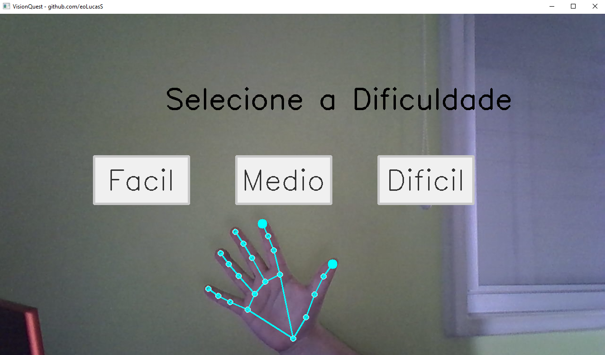

<!-- 
$$$$$$$\                                $$\                                     $$\       $$\
$$  __$$\                               $$ |                                    $$ |      $$ |
$$ |  $$ | $$$$$$\ $$\    $$\  $$$$$$\  $$ | $$$$$$\   $$$$$$\   $$$$$$\   $$$$$$$ |      $$$$$$$\  $$\   $$\
$$ |  $$ |$$  __$$\\$$\  $$  |$$  __$$\ $$ |$$  __$$\ $$  __$$\ $$  __$$\ $$  __$$ |      $$  __$$\ $$ |  $$ |
$$ |  $$ |$$$$$$$$ |\$$\$$  / $$$$$$$$ |$$ |$$ /  $$ |$$ /  $$ |$$$$$$$$ |$$ /  $$ |      $$ |  $$ |$$ |  $$ |
$$ |  $$ |$$   ____| \$$$  /  $$   ____|$$ |$$ |  $$ |$$ |  $$ |$$   ____|$$ |  $$ |      $$ |  $$ |$$ |  $$ |
$$$$$$$  |\$$$$$$$\   \$  /   \$$$$$$$\ $$ |\$$$$$$  |$$$$$$$  |\$$$$$$$\ \$$$$$$$ |      $$$$$$$  |\$$$$$$$ |
\_______/  \_______|   \_/     \_______|\__| \______/ $$  ____/  \_______| \_______|      \_______/  \____$$ |
                                                      $$ |                                          $$\   $$ |
                                                      $$ |                                          \$$$$$$  |
                                                      \__|                                           \______/
$$\                                                   $$\                                                          $$\                  $$$$$$\  $$\ $$\
$$ |                                                  $$ |                                                         $$ |                $$  __$$\ \__|$$ |
$$ |     $$\   $$\  $$$$$$$\ $$$$$$\   $$$$$$$\       $$ |      $$$$$$\   $$$$$$\   $$$$$$\   $$$$$$$\        $$$$$$$ | $$$$$$\        $$ /  \__|$$\ $$ |$$\    $$\ $$$$$$\
$$ |     $$ |  $$ |$$  _____|\____$$\ $$  _____|      $$ |     $$  __$$\ $$  __$$\ $$  __$$\ $$  _____|      $$  __$$ | \____$$\       \$$$$$$\  $$ |$$ |\$$\  $$  |\____$$\
$$ |     $$ |  $$ |$$ /      $$$$$$$ |\$$$$$$\        $$ |     $$ /  $$ |$$ /  $$ |$$$$$$$$ |\$$$$$$\        $$ /  $$ | $$$$$$$ |       \____$$\ $$ |$$ | \$$\$$  / $$$$$$$ |
$$ |     $$ |  $$ |$$ |     $$  __$$ | \____$$\       $$ |     $$ |  $$ |$$ |  $$ |$$   ____| \____$$\       $$ |  $$ |$$  __$$ |      $$\   $$ |$$ |$$ |  \$$$  / $$  __$$ |
$$$$$$$$\\$$$$$$  |\$$$$$$$\\$$$$$$$ |$$$$$$$  |      $$$$$$$$\\$$$$$$  |$$$$$$$  |\$$$$$$$\ $$$$$$$  |      \$$$$$$$ |\$$$$$$$ |      \$$$$$$  |$$ |$$ |   \$  /  \$$$$$$$ |
\________|\______/  \_______|\_______|\_______/       \________|\______/ $$  ____/  \_______|\_______/        \_______| \_______|       \______/ \__|\__|    \_/    \_______|
                                                                         $$ |
                                                                         $$ |
                                                                         \__|
-->
<h1 align="center">
  Jogo Interativo de Matemática com Visão Computacional 
</h1>

  
  
  

 

  

 

## 📝 Descrição 

O VisionQuest é uma ferramenta educacional interativa desenvolvida com o objetivo de promover a educação inclusiva e acessível. O projeto utiliza tecnologias de reconhecimento de mãos para criar uma experiência de aprendizagem divertida e inovadora, baseada em conceitos matemáticos fundamentais. Alinhado ao ODS 4 da ONU, o jogo visa assegurar a educação de qualidade, promovendo oportunidades de aprendizagem para todos.

## 🚀 Funcionalidades Desenvolvidas

### 1. Reconhecimento de Mãos e Gestos

- **Bibliotecas Utilizadas**: MediaPipe e OpenCV para reconhecimento de mãos em tempo real.
- **Detecção Ambidestra**: O sistema reconhece ambas as mãos simultaneamente.
- **Gestos Interativos**: O gesto de pinça é utilizado para seleção e interação com os botões do jogo.
- **Aprimoramento Visual**: Personalização da cor dos marcadores de mãos para azul ciano, proporcionando uma interface mais limpa e intuitiva.

### 2. Geração de Questões Matemáticas

- **Três Níveis de Dificuldade**: Fácil, Médio e Difícil, atendendo diferentes níveis de conhecimento.
- **Tipos de Questões**:
  - Operações aritméticas (adição, subtração, multiplicação e divisão).
  - Equações do primeiro grau.
  - Potências, raízes quadradas e logaritmos.
  - Identificação de pontos em um plano cartesiano interativo.

### 3. Interface Interativa

- **Botões Virtuais**: Seleção de respostas e níveis de dificuldade via botões interativos.
- **Plano Cartesiano Dinâmico**: Um plano cartesiano é desenhado dinamicamente com grid e numeração dos eixos, permitindo que os usuários encontrem pontos específicos.
- **Feedback Imediato**: Feedback visual instantâneo ao usuário, indicando acertos e erros.

### 4. Estrutura Modular

- **Módulos Separados**:
  - `option_button.py`: Manipulação de botões interativos.
  - `question_generator.py`: Geração das perguntas com base na dificuldade.
  - `cartesian_plane.py`: Desenho e interação com o plano cartesiano.
  - `main.py`: Integra todos os módulos para gerenciar o fluxo do jogo.

## 📚 Bibliotecas e Ferramentas

- [Python](https://www.python.org/)
- [OpenCV](https://opencv.org/)
- [MediaPipe](https://github.com/google-ai-edge/mediapipe)
- [NumPy](https://numpy.org/)
- [Visual Studio Code](https://code.visualstudio.com/)

## 💡 Avanços Realizados

- **Integração Completa do Plano Cartesiano**: Agora, os usuários podem interagir diretamente com o plano cartesiano, identificando pontos solicitados nas perguntas.
- **Detecção Melhorada de Mãos**: A detecção de mãos foi aprimorada, suportando interações com ambas as mãos.
- **Feedback em Tempo Real**: O jogo oferece feedback imediato, proporcionando uma experiência de aprendizado mais engajante.

## 📊 Alinhamento com a Ementa Acadêmica

O projeto aborda diversos tópicos da ementa acadêmica de matemática, incluindo:

- Aritmética de Inteiros
- Álgebra Linear
- Produto Cartesiano (plano cartesiano interativo)
- Operações com potências e logaritmos

## 🔗 Links

 
  
 

 

 

 
## 💻 Colaboradores 
<table>
  <tr>
    <td align="center">
      <a href="https://www.linkedin.com/in/lucaslopesdasilva/">
         
        
          <b>Lucas Silva</b>
        
      </a>
    </td>
    <td align="center">
      <a href="https://www.linkedin.com/in/nycolasagrgarcia/">
         
        
          <b>Nycolas Garcia</b>
        
      </a>
    </td>
    <td align="center">
      <a href="https://www.linkedin.com/in/danilodoes/">
         
        
          <b>Danilo Santos</b>
        
      </a>
    </td>
    <td align="center">
      <a href="https://encrypted-tbn0.gstatic.com/images?q=tbn:ANd9GcTfPlyqvw8T_cZvq5gRM59jqm8KIE44_ugokQ&s">
         
        
          <b>Letícia Araujo</b>
        
      </a>
    </td>
  </tr>
</table>

-----

<h3 align="center"> Desenvolvido por <a href="https://www.linkedin.com/in/lucaslopesdasilva/">Lucas Lopes da Silva</a> ☕</h3>